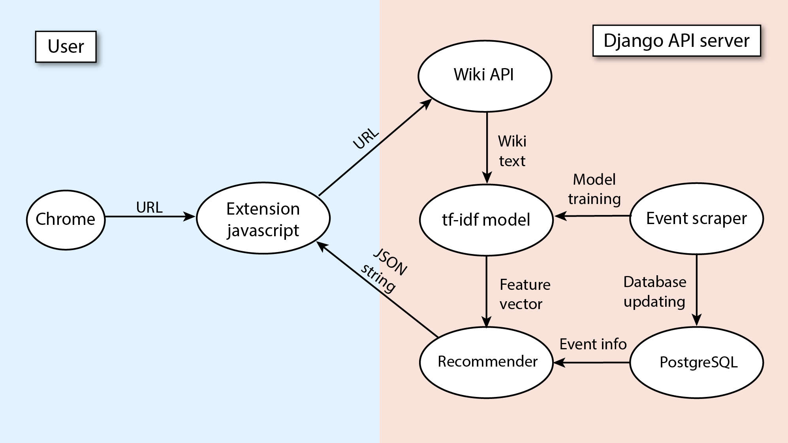

# Weekendpedia Django API

This is the Django API server source codes for the the [Insight Data Science](https://insightdatascience.com) Project [Weekendpedia](https://chrome.google.com/webstore/search/weekendpedia). 

[**Weekendpedia**](https://chrome.google.com/webstore/search/weekendpedia) is an Chrome extension that recommend cultural events (in galleries, museums, etc) in New York City for Wikipedia users. The extension will track the current Wikipedia topic that the user is viewing, and alert the user when a relevant cultural event is found. This repo contains the Django backend for the API server (in [```./insight_api_src```](./insight_api_src)), and a notebook that explains how the recommender works (in [```./recommender_prototype```](./recommender_prototype)). The event data is scraped from [nyc.com](https://www.nyc.com/) (stored in [```./insight_api_data```](./insight_api_data)).

### Recommendation algorithm

The server uses keyword extraction and [TF-IDF](https://en.wikipedia.org/wiki/Tf%E2%80%93idf "TF-IDF") for content recommendation. Keywords are captured using [named entity recognition (NER)](https://en.wikipedia.org/wiki/Named-entity_recognition "NER") and [part-of-speech (PoS)](https://en.wikipedia.org/wiki/Part_of_speech "PoS") tagging. The IDF space is defined by the keywords from the event descriptions. The [cosine similarities](https://en.wikipedia.org/wiki/Cosine_similarity) between TF-IDF feature vectors of the wiki articles and all the event descriptions are calculated. Event information is returned to users if the similarities are higher than the threshold.

More details are explained in the [**notebook**](./recommender_prototype/event_recommender_prototype.ipynb) and the [**slides**](./Slides/Weekendpedia.pdf).

### Service details



The Chrome extension sends the URL to the Django server if the user is currently navigating to Wikipedia. The wiki topic is extracted from the URL, and the intro text of the corresponding wiki page is retrieved using the API provided by Wikipedia. The text is converted to a feature vector, using the pre-calculated IDF weights of the keywords from event descriptions. The cosine similarities between the feature vector and all the pre-calculated feature vectors of the events are calculated by the recommender. If the similarities are higher than the threshold, the information (name, link, etc) of the corresponding event is retrieved by the recommender from the PostgreSQL server linked to the Django server, and returned to the user Chrome extension as JSON strings. The IDF weights, the feature vectors of the events and the PostgreSQL database are updated once the events are updated.

### Components of the server

The Django API server has three main components: extractor, vectorizer and recommender. 

The **extractor** ([```./insight_api_src/extractor/```](./insight_api_src/extractor/)) retrieves pure texts of the Wikipedia topic that the user is viewing, using the API provided by Wikipedia. The functions are defined in [```./insight_api_src/extractor/views.py```](./insight_api_src/extractor/views.py).

The **vectorizer** ([```./insight_api_src/vectorizer/```](./insight_api_src/vectorizer/)) converts the text into a feature vector using TF-IDF algorithm (details are explained in the notebook in ```./recommender_prototype```), and sent to the recommender. The functions are defined in [```./insight_api_src/extractor/views.py```](./insight_api_src/extractor/views.py).

The **recommender** ([```./insight_api_src/vectorizer/```](./insight_api_src/vectorizer/)) calculates the cosine similarities between the feature vectors of the wiki texts and the pre-calcualted feature vectors of the events. Events are recommended when the similarities are higher than the threshold. The event infomation (name, description, link, etc) is retrieved from the PostgreSQL server and returned as JSON strings. The functions are defined in [```./insight_api_src/extractor/views.py```](./insight_api_src/extractor/views.py).

The source codes for the Chrome extension is in another [**repo**](https://github.com/jiananarthurli/insight_chrome_extension.git). 
